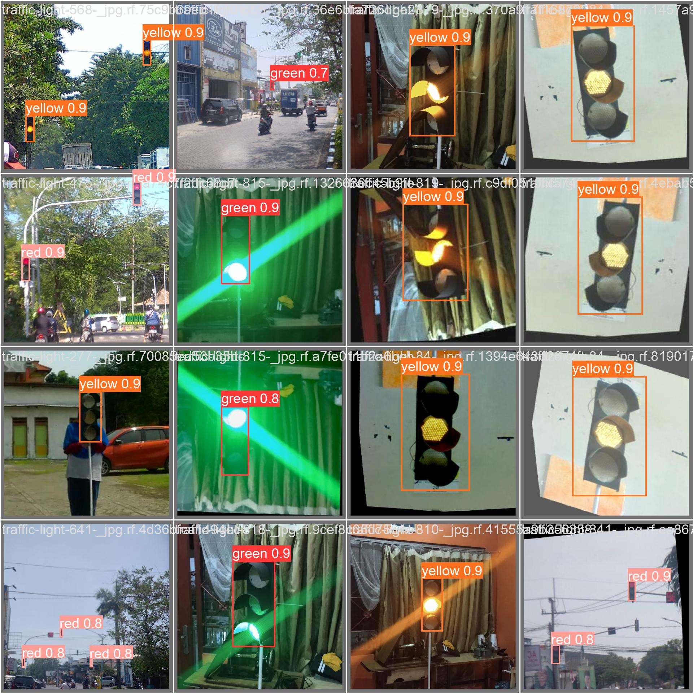
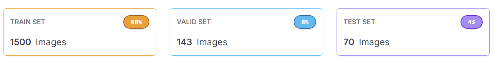
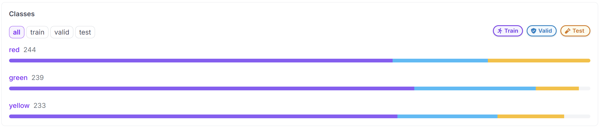
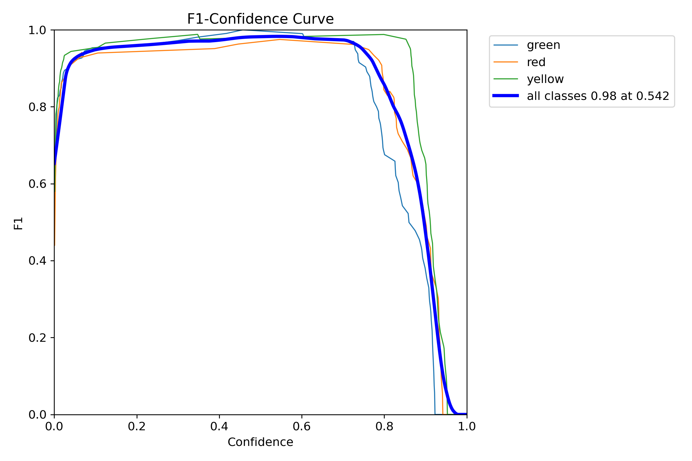
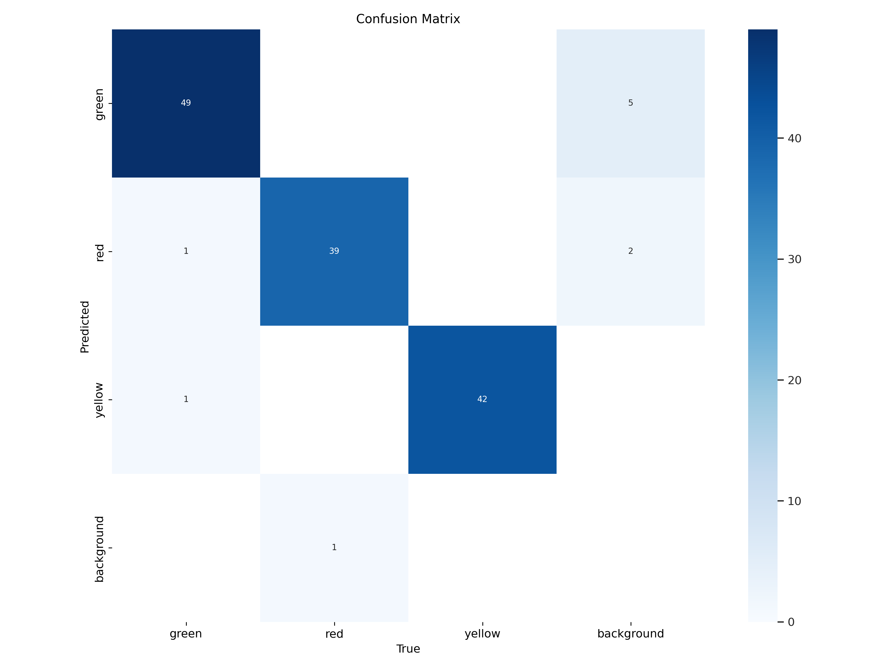
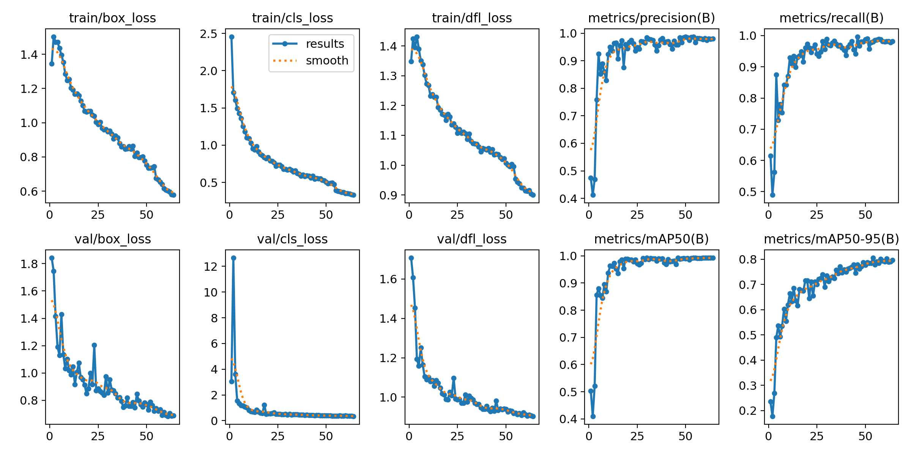

# Traffic Light Detection and Classification


## Project Overview

The **Traffic Light Detection and Classification** project aims to enhance autonomous driving systems by accurately detecting and classifying traffic lights. The model is designed to generate appropriate physical responses for vehicles equipped with it. This project is part of a larger hardware initiative, currently under development, focusing on the practical implementation of the model.

## Team Members

1. [Mahesh Paul J](https://github.com/CityIsBetter)
2. [Pranav T](https://github.com/Pranav0518)
3. [G Sai Vasanth](https://github.com/saivasanthg)

## Installation and Dependencies

To set up the project locally, please ensure all dependencies listed in the [`requirements.txt`](./requirements.txt) file are installed. You can install them using the following command:

```bash
pip install -r requirements.txt
```

## Features

- **Autonomous Detection and Classification of Traffic Lights:** The model can autonomously detect and classify traffic lights in various environments.
- **Adaptive Response Generation:** Generates appropriate responses based on the detected traffic lights.
- **Hardware Integration:** Seamlessly integrates with hardware systems for practical real-world implementation.

## Data

- **Data Collection:** 
  - Approximately 30% of the images were collected by the team.
  - The remaining images were sourced from the internet.
  
- **Dataset Details:**
  - A total of 1,713 images were used for training, validation, and testing.   
  - Images were augmented to triple the original dataset size. Augmentation techniques included cropping, rotation, brightness adjustment, and noise addition.
  - The dataset maintains an almost equal ratio of all classes for training and testing, with minor differences.  

- **Challenges and Solutions:**
  - **False Positive Detections:** One major challenge encountered was false positive detections. This issue was addressed by incorporating appropriately labeled negative images into the training dataset.

## Performance Evaluation

### Model Evaluation Metrics


 | **F1 Curve:** | **Confusion Matrix:** |
 | --- | --- |
 |  |  |

- **Overall Metrics:** 

For more detailed information on final accuracy levels and performance metrics, please refer to the [Performance Evaluation](./performance-insights) and [Train Metrics](./train-metrics) given files.

---

*This project is continuously evolving. Contributions and feedback are welcome!*
